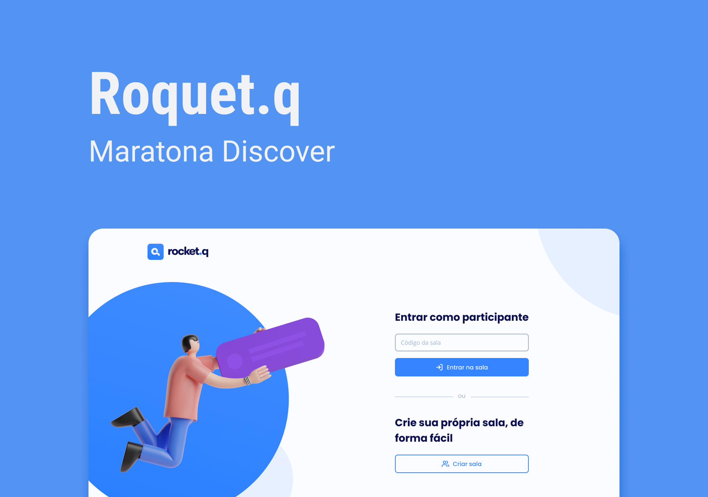

<div align="center">
    <h1 align="center">Rocket.q</h1>
    <p>Rocket.q é uma aplicação para gerenciar perguntas anônimas de usuários direcionadas ao dono da página.</p>
    
</div>

---

## Índice

- [Descrição](#descrição)
- [Features](#features)
- [Techs](#techs)
  - [Libs](#Libs)
- [Design](#design)
  - [Cores](#cores)
  - [Tipo de fonte](#tipo-de-fonte)
  - [Pacote de ícones](#pacote-de-ícones)
  - [Utilitários](#utilitários)
- [Instalação](#instalação)
- [Links Contato](#links-contato)
- [Licença](#licença)

# Descrição

Rocket.q é uma aplicação para gerenciar perguntas anônimas de usuários direcionadas ao dono da página. Projeto desenvolvido na semana #NLW/Together na missão Discover realizada pela [**@Rocketseat**](https://github.com/Rocketseat)

## Features:

- [x] Criação de salas<br>
- [x] Entrar na sala com o código gerado<br>
- [x] Cadastro de perguntas<br>
- [x] Marcar pergunta como lida<br>
- [x] Excluir pergunta<br>
- [x] Verificacão para exclusão e edição de perguntas com senha<br>
- [x] Banco de dados<br>

# Techs:

- **HTML**
- **CSS**
- **JavaScript**
- **Node.js**
- **MySQL**

## Libs:

- **Express**
- **EJS**
- **Nodemom**
- **SQLite**

# Design:

- O modelo final para desktop e mobile está disponível na pasta `./design`
- Imagens disponíveis na pasta `./public/images`<br>

## Cores:

- Dark: #0F241D<br>
- Primary color: #69B99D<br>
- Second color: #CCF4E6<br>
- Background 1: #F9F9F9<br>
- Background 2: #FFFFFF<br>

## Tipo de fonte:

- **Poppins** Regular 400, Medium 500, Bold 700
- **DM Sans** Regular 400, Medium 500, Bold 700

## Pacote de ícones:

- **Feather**

## Utilitários

- [figma.com](https://www.figma.com/)

# Instalação:

```bash
  # Clone este repositório:
  $ git clone https://github.com/CleilsonAndrade/rocketq.git
  $ cd ./rocketq

  # Instale as dependências, crie o banco de dados e após inicie o servidor:
  $ npm install
  $ npm run init-db
  $ npm start
```

# Links Contato

- **Linkedin:** https://www.linkedin.com/in/cleilson-andrade/<br>
- **GitHub:** https://github.com/CleilsonAndrade<br>

# Licença

<p align="center"><a href="https://github.com/CleilsonAndrade/rocketq/blob/master/LICENSE"></a></p>
