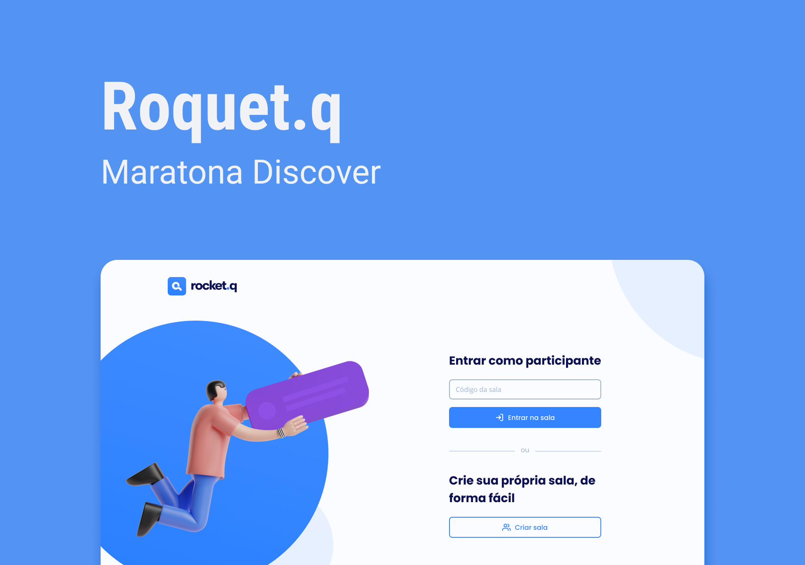

<div align="center">
    <h1 align="center">Rocket.q</h1>
    <p>Rocket.q é uma aplicação para gerenciar perguntas anônimas de usuários direcionadas ao dono da página.</p>
    
</div>

# 📒 Índice
* [Descrição](#descrição)
* [Requisitos Funcionais](#requisitos)
  * [Features](#features)
* [Tecnologias](#tecnologias)
* [Design](#design)
  * [Cores](#cores)
  * [Fontes](#fontes)
  * [Ícones](#ícones)
* [Instalação](#instalação)
* [Licença](#licença)

# 📃 <span id="descrição">Descrição</span>
Rocket.q é uma aplicação para gerenciar perguntas anônimas de usuários direcionadas ao dono da página. Projeto desenvolvido na semana #NLW/Together na missão Discover realizada pela [**@Rocketseat**](https://github.com/Rocketseat), utilizando tecnologias como [**NodeJS**](https://nodejs.org/en), [**Express**](https://expressjs.com/pt-br/), [**SQLite**](https://www.sqlite.org/). 

# 📌 <span id="requisitos">Requisitos Funcionais</span>
- [x] Criação de salas<br>
- [x] Cadastro de perguntas<br>
- [x] Marcar pergunta como lida<br>
- [x] Excluir pergunta<br>
- [x] Salvar de dados<br>

## Features
- [x] Entrar na sala com o código gerado<br>
- [x] Verificação para exclusão e edição de perguntas com senha<br>

# 💻 <span id="tecnologias">Tecnologias</span>
- **HTML**
- **CSS**
- **JavaScript**
- **NodeJS**
- **Express**
- **EJS**
- **Nodemom**
- **SQLite**

# 🎨 <span id="design">Design</span>
- O modelo final para desktop e mobile está disponível na pasta `./design`

- <span id="cores">Cores<br></span>
  * #0F241D<br>
  * #69B99D<br>
  * #CCF4E6<br>
  * #F9F9F9<br>
  * #FFFFFF<br>

- <span id="fontes">Fontes<br></span>
   * Poppins, DM Sans, sans-serif

- <span id="ícones">Ícones<br></span>
   * Feather

# 🚀 <span id="instalação">Instalação</span>
```bash
  # Clone este repositório:
  $ git clone https://github.com/CleilsonAndrade/rocketq.git
  $ cd ./rocketq

  # Instalar as dependências:
  $ yarn install

  # Iniciar banco de dados:
  $ yarn init-db

  # Executar:
  $ yarn start
```
# Licença

# 📝 <span id="licença">Licença</span>
Esse projeto está sob a licença MIT. Veja o arquivo [LICENSE](LICENSE) para mais detalhes.

---

<p align="center">
  Feito com 💜 by CleilsonAndrade
</p>